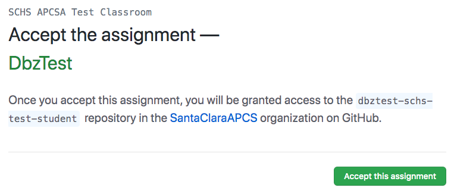
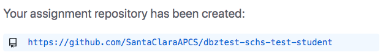
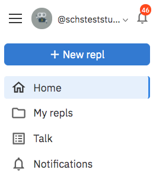
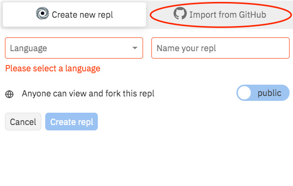
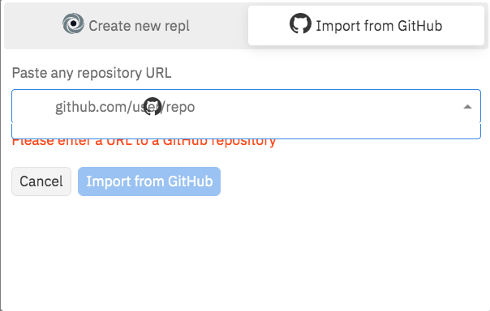
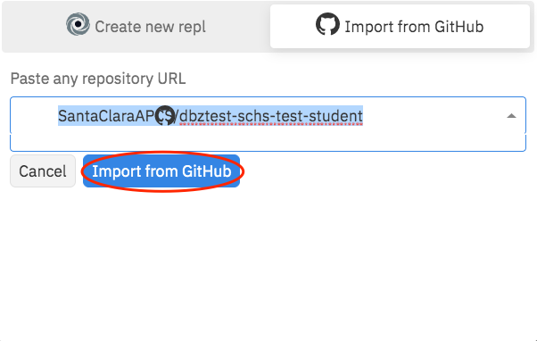
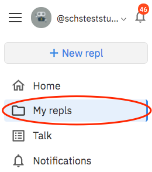
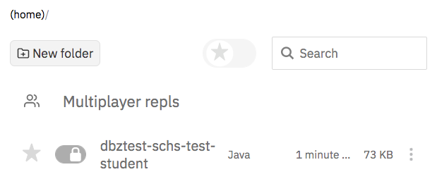

author: Jerry Chang
summary: Walkthrough of Dragon Ball Z Game 
id: dragonball-z-game
categories: APCSA
environments: Web
status: Published
feedback link: github.com/changjerry

# Dragon Ball Z Game Project

## Introduction
[Dragon Ball Z] (https://en.wikipedia.org/wiki/Dragon_Ball_Z) is an anime series which features heroes who defend the earth from villains. For this project, you will use your Java skills to build a console game in the spirit of the [Dragon Ball FighterZ game] (https://en.wikipedia.org/wiki/Dragon_Ball_FighterZ).


## Rules of the Game

Your Dragon Ball Z game is a two-player game where a human player will compete against a computer player in an epic fight! Both players start the game with zero energy points and three life points. The game ends when one player reaches zero life points or after 30 turns.

Every turn, both players must choose one of the following moves:
* Charge Energy (+1 energy point)  🔋
* Attack (-1 energy point)   ⚔️
* Special Attack (-8 energy points) ⚡️
* Defend (0 energy points)          🛡

**Note**: Players can only attack if they have charged up sufficient energy points.

<a name="move-table"></a>
The following table shows the result of a pair of moves chosen by two players:

| **Player 1**       | **Player 2**     |   **Player 1 Result**  | **Player 2 Result** |
| :------------- | :----------: | :----------------: |-----------------: |
|  Charge Energy 🔋 | Charge Energy 🔋| +1 energy point| +1 energy point |
|  Attack ⚔️  | Charge Energy 🔋| -1 energy point | -1 life point, reset energy points|
|  Special Attack  ⚡️ | Charge Energy 🔋| -8 energy point| -3 life points, reset energy points |
|  Defend 🛡  | Charge Energy 🔋| nothing | +1 energy point|
|  Attack ⚔️ | Attack ⚔️| -1 life point, reset energy points| -1 life point, reset energy points |
|  Special Attack  ⚡️  | Attack ⚔️| -8 energy points | -3 life points, reset energy points|
|  Defend 🛡| Attack ⚔️| nothing | -1 energy point |
|  Special Attack  ⚡️  | Special Attack  ⚡️| -1 life point, reset energy points | -1 life point, reset energy points|
|  Defend 🛡 | Special Attack  ⚡️| -3 life points, reset energy points| -8 energy points |
|  Defend 🛡 | Defend 🛡 | nothing | nothing |


## Example Gameplay 

### Begin the Game
When the game starts, the player and computer both start out with 0 energy points and 3 life points.
Print out each player's points to start the game.

```console
Starting the Dragon Ball Z Game!
Player Energy Points: 0
Player Life Points: 3

Computer Energy Points: 0
Computer Life Points: 3
```

### Start a Turn
Prompt the player to select a valid move based on their energy points. If the player does not have
enough energy points for an attack, do not prompt the player to attack.

```console
Turn 1
Select from one of the following moves ("defend", "charge energy"): charge energy
```

### Determine Outcome From Turn 1
Print out the moves that were chosen by the player and the computer as well as the life points and energy points.

```console
Player Move: charge energy
Computer Move: charge energy

Result
Player Energy Points: 1
Player Life Points: 3

Computer Energy Points: 1
Computer Life Points: 3
```

### Start Another Turn
Prompt the player to select a valid move based on their energy points.

```console
Turn 2
Select from one of the following moves ("attack", "defend", "charge energy"): attack
```

### Determine Outcome From Turn 2
Print out the moves that were chosen by the player and the computer as well as the life points and energy points.

```console
Player Move: attack
Computer Move: defend

Result
Player Energy Points: 0
Player Life Points: 3

Computer Energy Points: 1
Computer Life Points: 3
```

### Start Another Turn
Prompt the player to select a valid move based on their energy points.

```console
Turn 3
Select from one of the following moves ("defend", "charge energy"): charge energy
```

### Determine Outcome From Turn 3
Print out the moves that were chosen by the player and the computer as well as the life points and energy points.

```console
Player Move: charge energy
Computer Move: attack

Result
Player Energy Points: 0
Player Life Points: 2

Computer Energy Points: 0
Computer Life Points: 3
```

### End the Game if a Player Loses All Life Points
Once a player has lost all of their life points, the other player is named the winner and the game ends.

```console
Player Move: charge energy
Computer Move: special attack

Result
Player Energy Points: 0
Player Life Points: 0

Computer Energy Points: 0
Computer Life Points: 1

Computer Wins!
```

### End the Game after 30 turns
If neither player has lost all of their life points after 30 turns, the game ends as a tie.

```console
Player Move: defend
Computer Move: defend

Result
Player Energy Points: 0
Player Life Points: 3

Computer Energy Points: 0
Player Life Points: 3

No winner after 30 turns!
```

## Project Set-Up: Accept the Assignment

### Follow GitHub Classroom link for project.

### Click “Accept this assignment”.



### A copy of the assignment will be generated for you. Once it is done, copy or write down the link URL, then click on it. This will take you to your code repository for the assignment.



## Project Set-Up: Open assignment in repl.it 

Negative
: These steps should only be done once:

### Go to repl.it and click on “+ New repl”.


### Select “Import from GitHub” in the pop up.


### Type or paste the URL from your GitHub code repository in the text box and click on “Import from GitHub”.




## Project Set-Up: Accessing your code on repl.it:

### Click on “My repls”.



### Find the link to the repl.it for the assignment in the list.




## How To Run Tests

You may change the contents of the .env file to change which tests you want to run:

* RUNCLASS=DbzGame to run main method in DbzGame.
* RUNCLASS=Checkpoint1Tests to run Checkpoint 1 tests.
* RUNCLASS=Checkpoint2Tests to run Checkpoints 1 - 2 tests.
* RUNCLASS=Checkpoint3Tests to run Checkpoints 1 - 3 tests.
* RUNCLASS=Checkpoint4Tests to run Checkpoints 1 - 4 tests.
* RUNCLASS=Checkpoint5Tests to run Checkpoints 1 - 5 tests.

## Checkpoint 1: Begin the Game
To begin the game, ensure that the energy points and life points for the player and computer are initialized.

Write a method with the following signature that takes the player's energy points, the player's life points, the computer's energy points, and the computer's life points.
as input and prints out these points to the console.

**public static void printPoints(int playerEnergyPoints, int playerLifePoints, int computerEnergyPoints, int computerLifePoints);**

```console
Player Energy Points: 0
Player Life Points: 3

Computer Energy Points: 0
Computer Life Points: 3
```

When you are done, commit your code and move on to checkpoint 2.

## Checkpoint 2: Select User Move
To begin a turn, print the turn number and prompt the user to enter a valid move.

Write a method with the following siganture that takes as input the player's energy point, prompts the user to enter a move, and returns the move the player entered.

**public static String getUserMove(int energyPoints);** 

```console
Select from one of the following moves ("defend", "charge energy"): defend
```

Negative
: Be sure to include error checking to ensure the user enters a valid move. If the player enters an invalid move, either select a valid one for them or continue asking for a valid move.

## Checkpoint 3: Select Computer Move
Write a method with the following signature that takes as input the computer's energy point and returns a randomly selected valid move for the computer.

**public static String getComputerMove(int energyPoints);** 

## Checkpoint 4: Calculate Energy Point Cost
Write a helper method that takes as input a valid move and returns the amount of energy the move will cost. 

**public static int getEnergyPointsCost(String move);** 

* "attack" should returns 1.
* "charge energy" returne -1.
* "special attack" returns 8.
* "defend" returns 0. 

## Checkpoint 5: Calculate Life Point Cost
Write a method with the following signature that takes as input a player's valid move and an opponent's valid move and returns the amount of life points to deduct from the player.

**public static int getLifePointsCost(String playerMove, String opponentMove);** 

Use the table from "Rules of the Game" to determine which scenarios will result in a life point deduction.

The getLifePointsCost method can be used to deduct life points for either the player or the computer.

## Checkpoint 6: Begin a Turn
1. In the main method, begin the game by calling **printPoints**. 
2. Prompt the user for a move by calling **getUserMove**.
3. Get the computer's move by calling **getComputerMove**.
4. Deduct or increase the player's energy points by calling **getEnergyPointsCost**.
5. Deduct or increase the computer's energy points by calling **getEnergyPointsCost**.
6. Deduct or increase the players's life points by calling **getLifePointsCost**.
7. Deduct or increase the computer's life points by calling **getLifePointsCost**.
8. Print the result of the move by calling **printPoints**

## Checkpoint 7: Continue the Game
Add a for loop to the main method to ensure that 30 turns can be played. Be sure to print the turn number before each turn.

## Checkpoint 8: Determine Winner
Within the for loop, check the life points for each player. If any life points are lost, be sure to reset that player's energy points before the next turn.

If any player loses all of their life points, declare the other player the winner and end the game.

```console
Player Move: charge energy
Computer Move: special attack

Result
Player Energy Points: 0
Player Life Points: 0

Computer Energy Points: 0
Computer Life Points: 1

Computer Wins!
```

## Checkpoint 9 (challenge): Easy, Medium, and Hard
When the game begins, prompt the user to choose between three levels of computer difficulty. 

Implement different strategies for each difficulty level to make the game harder or easier.

```console
Choose difficulty from Easy, Medium, and Hard: Easy
```

## Checkpoint 10 (challenge): Human vs Human
When the game begins, prompt the user to choose between playing with a human or a computer.

If they select to play with a human, ensure that both players are prompted to select a move each turn. 

```console
Choose to play against a human or a computer: human
```

## Checkpoint 11 (challenge): Computer vs Computer
When the game begins, prompt for a human or computer for player 1 and player 2.

If they select a computer for both, play a simulated game

```console
Choose a human or a computer for Player 1: computer
Choose difficulty from Easy, Medium, and Hard for Player 1: Easy
Choose a human or a computer for Player 2: computer
Choose difficulty from Easy, Medium, and Hard for Player 2: Hard
```

## Checkpoint 12 (challenge): Three Player Game
When the game begins, prompt for the number of players and support 2 or 3 players.

Modify the game to work with three players (human or computer).

```console
Enter the number of player (2 or 3): 
```
