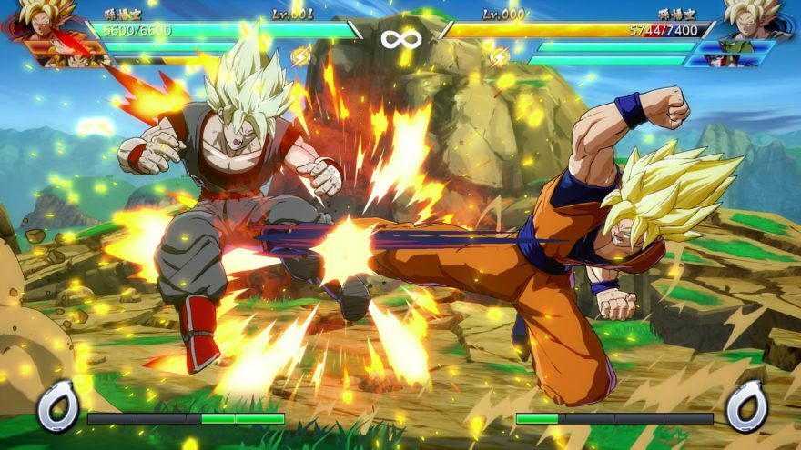

author: Jerry Chang
summary: Walkthrough of Dragon Ball Z Game 
id: dragonball-z-game
categories: APCSA
environments: Web
status: Published
feedback link: github.com/changjerry

# Dragon Ball Z Game Project

## Introduction
[Dragon Ball Z] (https://en.wikipedia.org/wiki/Dragon_Ball_Z) is an anime series which features heroes who defend the earth from villains. For this project, you will use your Java skills to build a console game in the spirit of the [Dragon Ball FighterZ game] (https://en.wikipedia.org/wiki/Dragon_Ball_FighterZ).

## Rules of the Game

Your Dragon Ball Z game is a two-player game where a human player will compete against a computer player in an epic fight! Both players start the game with zero energy points and three life points. The game ends when one player reaches zero life points or after 30 moves.

Every turn, both players must choose one of the following moves:
* Charge Energy (+1 energy point)  🔋
* Normal Attack (-1 energy point)   ⚔️
* Special Attack (-8 energy points) ⚡️
* Defend (0 energy points)          🛡

**Note**: Players can only attack if they have charged up sufficient energy points.

The following table shows the result of a pair of moves chosen by two players:

| **Player 1**       | **Player 2**     |   **Player 1 Result**  | **Player 2 Result** |
| :------------- | :----------: | :----------------: |-----------------: |
|  Charge Energy 🔋 | Charge Energy 🔋| +1 energy point| +1 energy point |
|  Normal Attack ⚔️  | Charge Energy 🔋| -1 energy point | -1 life point, reset energy points|
|  Special Attack  ⚡️ | Charge Energy 🔋| -8 energy point| -3 life points, reset energy points |
|  Defend 🛡  | Charge Energy 🔋| nothing | +1 energy point|
|  Normal Attack ⚔️ | Normal Attack ⚔️| -1 life point, reset energy points| -1 life point, reset energy points |
|  Special Attack  ⚡️  | Normal Attack⚔️| -8 energy points | -3 life points, reset energy points|
|  Defend 🛡| Normal Attack ⚔️| nothing | -1 energy point |
|  Special Attack  ⚡️  | Special Attack  ⚡️| -1 life point, reset energy points | -1 life point, reset energy points|
|  Defend 🛡 | Special Attack  ⚡️| -3 life points, reset energy points| -8 energy points |
|  Defend 🛡 | Defend 🛡 | nothing | nothing |

## Feature List

To build this game, you will implement as many features as you can from the following list:

### 1. Calulate Energy Point Costs [3 points]

Implement a method which takes as input a player's move and returns the energy cost for the move.

### 2. Calulate Life Point Costs [3 points]

Implement a method which takes as input the player's move and the opponent's move and returns the number of life points that were lost for the player.

